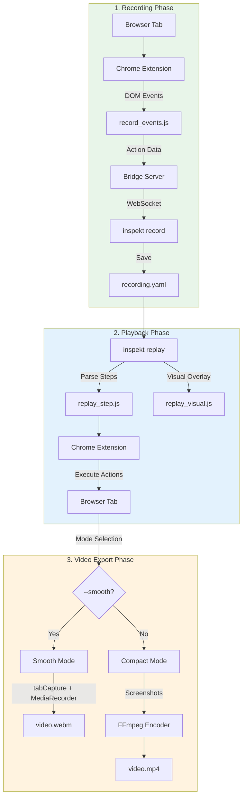
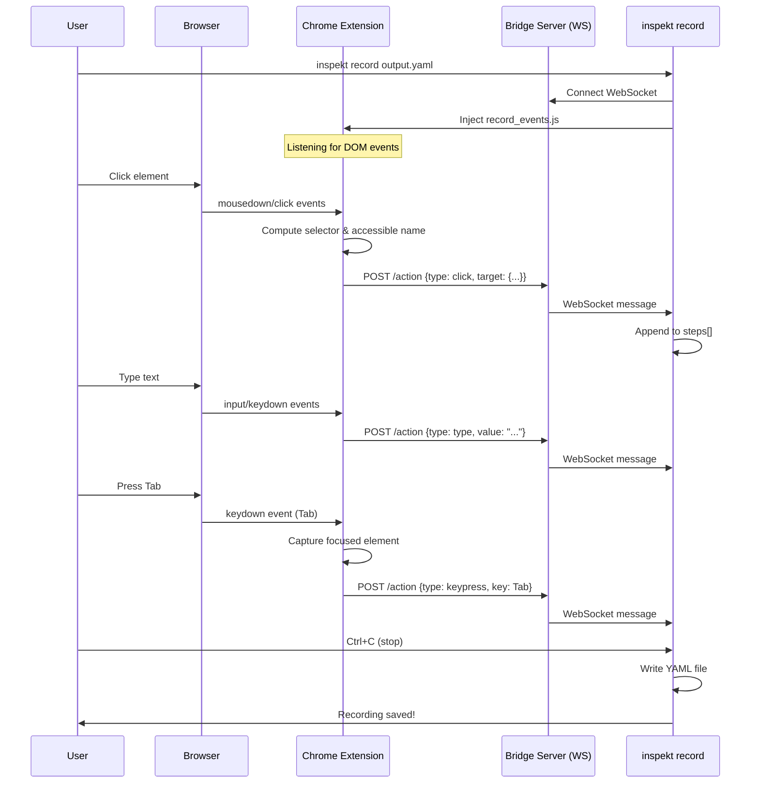
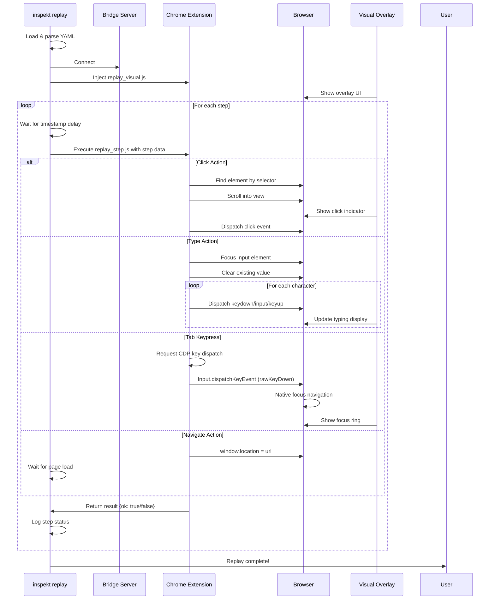
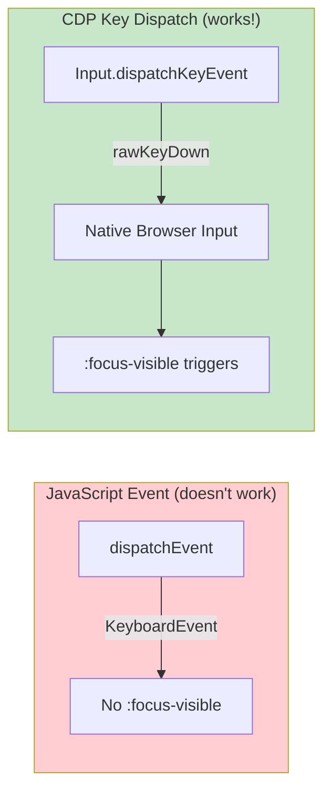
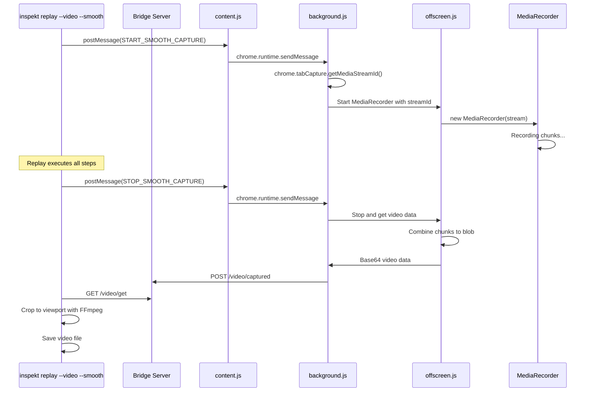
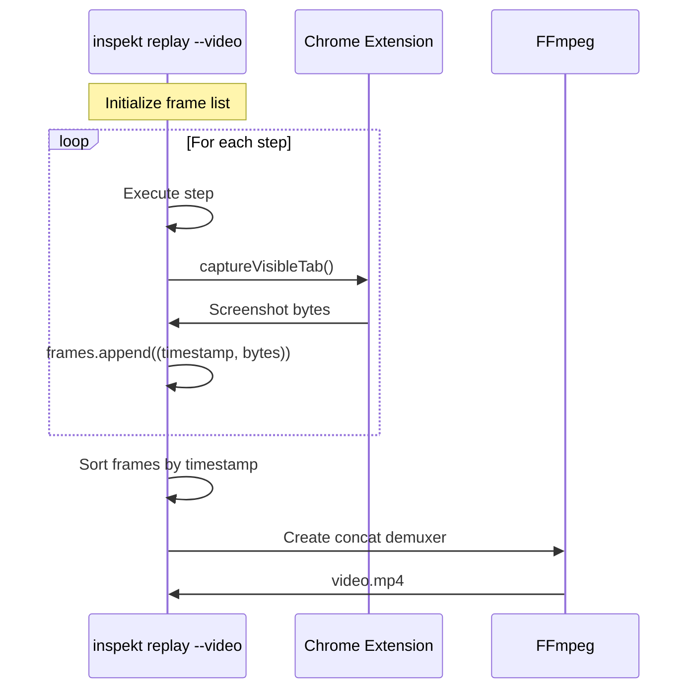
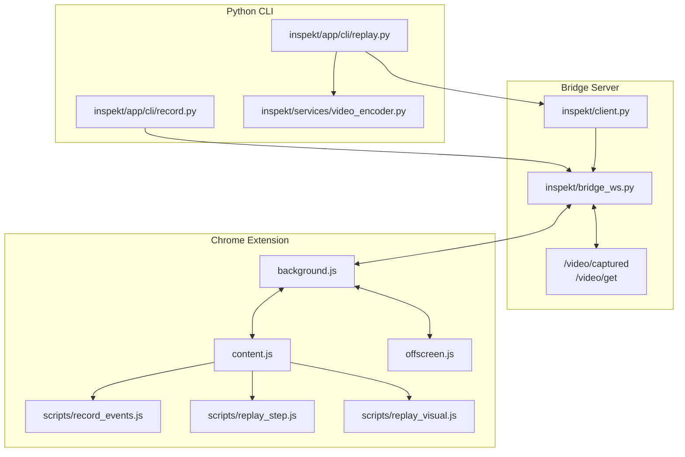

# Recording, Playback & Video Export Architecture

This document explains how Inspekt's recording, playback, and video export systems work together.

## High-Level Overview



## Recording Flow

When you run `inspekt record`, the following happens:



### Recording YAML Structure

```yaml
metadata:
  created_at: "2025-12-18T20:00:00"
  url: "https://example.com"
  viewport:
    width: 1280
    height: 720

steps:
  - action: navigate
    url: "https://example.com"
    timestamp: 0

  - action: click
    target:
      selector: "button.login"
      accessible_name: "Log in"
      tag: button
    timestamp: 1250

  - action: type
    target:
      selector: "input[name=email]"
      accessible_name: "Email address"
    value: "user@example.com"
    timestamp: 2100

  - action: keypress
    key: Tab
    timestamp: 3500
```

## Playback Flow

When you run `inspekt replay recording.yaml`, the following happens:



### Tab Key Special Handling (CDP)

Tab navigation requires special handling to trigger `:focus-visible`:



## Video Export Modes

Inspekt supports two video recording modes, each optimized for different use cases:

### Mode Comparison

| Feature | Smooth Mode (`--smooth`) | Compact Mode (default) |
|---------|-------------------------|----------------------|
| **Capture Method** | tabCapture + MediaRecorder | Action screenshots |
| **Frame Rate** | Continuous (configurable FPS) | 1 frame per action |
| **File Size** | Larger (real video) | Smaller (slideshow) |
| **Animations** | Captures smoothly | May miss animations |
| **Scrolling** | Smooth scroll visible | Jump between positions |
| **Output Format** | WebM (native) or MP4 | MP4 or WebM |
| **Best For** | Demos, presentations | Documentation, diffs |

### Smooth Mode (`--smooth`)

Uses browser's native tab capture API (like screen sharing) with MediaRecorder for real video recording.



**Key characteristics:**
- Records continuously at specified FPS (default: 10)
- Captures animations, scrolling, hover effects smoothly
- Uses VP9 codec in WebM container
- Video cropped to viewport dimensions (removes black bars from tab capture)
- Requires offscreen document for MediaRecorder (MV3 limitation)

### Compact Mode (default)

Takes a screenshot after each action, creating a slideshow-style video.



**Key characteristics:**
- One frame per action (minimal file size)
- Uses FFmpeg concat demuxer for timing
- Each frame shown for duration until next action
- Good for documentation and visual diffs
- No animation capture between actions

### FFmpeg Concat Demuxer (Compact Mode)

The concat demuxer tells FFmpeg exactly how long to show each frame:

```
file '/tmp/frame_00000.jpg'
duration 2.300000
file '/tmp/frame_00001.jpg'
duration 0.200000
file '/tmp/frame_00002.jpg'
duration 1.500000
file '/tmp/frame_00002.jpg'
```

> **Note**: The last frame is listed twice (without duration) as required by FFmpeg's concat demuxer format.

## Component Architecture



## Key Files Reference

| Component | File | Purpose |
|-----------|------|---------|
| Record CLI | `inspekt/app/cli/record.py` | Recording command, YAML output |
| Replay CLI | `inspekt/app/cli/replay.py` | Playback command, video modes |
| Bridge Server | `inspekt/bridge_ws.py` | WebSocket server, video endpoints |
| Bridge Client | `inspekt/client.py` | Python ↔ Extension communication |
| Video Encoder | `inspekt/services/video_encoder.py` | FFmpeg wrapper (compact mode) |
| Recording Script | `inspekt/scripts/record_events.js` | DOM event capture |
| Replay Script | `inspekt/scripts/replay_step.js` | Action execution |
| Visual Overlay | `inspekt/scripts/replay_visual.js` | UI feedback during replay |
| Background.js | `extensions/chrome/background.js` | tabCapture, CDP, message routing |
| Content.js | `extensions/chrome/content.js` | postMessage bridge |
| Offscreen.js | `extensions/chrome/offscreen.js` | MediaRecorder for smooth mode |

## Usage Examples

```bash
# Smooth mode - continuous video recording (captures animations)
inspekt replay recording.yaml --video demo.webm --smooth
inspekt replay recording.yaml --video demo.mp4 --smooth --fps 15

# Compact mode - screenshot per action (smaller files)
inspekt replay recording.yaml --video output.mp4
inspekt replay recording.yaml --video output.webm --compact

# Additional options
inspekt replay recording.yaml --video --open          # Open after creation
inspekt replay recording.yaml --video --include-effects  # Add audio cues
```

---

*Last updated: 2025-12-19*
