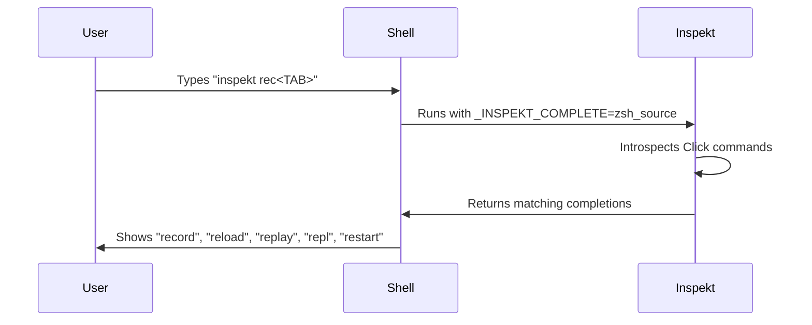

# Shell Completion

Inspekt provides intelligent tab completion for all commands, options, and arguments. This guide covers how to set up completions for your terminal.

## Overview

Inspekt uses Click's built-in shell completion, which queries the live CLI at runtime—so completions are always in sync with the installed version.

| Terminals | Sync | Features |
|-----------|------|----------|
| Bash, Zsh, Fish, Ghostty, iTerm2, VS Code, Warp | Automatic | Dynamic completions from live CLI |

---

## Shell Completion (Bash, Zsh, Fish)

This is the **recommended** completion system for most terminals. It uses Click's built-in completion mechanism, which queries the live CLI at runtime—so completions are always in sync with the installed version.

### Quick Install

The fastest way to set up completion:

```bash
inspekt completion install
```

This auto-detects your shell and adds completion to your config file.

### Manual Installation

If you prefer manual setup or the auto-install doesn't work:

=== "Bash"

    Add to your `~/.bashrc`:

    ```bash
    eval "$(_INSPEKT_COMPLETE=bash_source inspekt)"
    ```

    Then reload:
    ```bash
    source ~/.bashrc
    ```

=== "Zsh"

    Add to your `~/.zshrc`:

    ```bash
    eval "$(_INSPEKT_COMPLETE=zsh_source inspekt)"
    ```

    Then reload:
    ```bash
    source ~/.zshrc
    ```

=== "Fish"

    Add to `~/.config/fish/completions/inspekt.fish`:

    ```fish
    _INSPEKT_COMPLETE=fish_source inspekt | source
    ```

    Fish will auto-load completions from this directory.

### Check Installation Status

```bash
inspekt completion status
```

Example output:

```
┌─ Shell Completion ──────────────────────────────┐
│ Shell    │ zsh                                  │
│ Config   │ /Users/you/.zshrc                    │
│ Status   │ ✓ Installed                          │
└──────────────────────────────────────────────────┘
```

### Uninstall

```bash
inspekt completion uninstall
```

---

## Completion Features

### Command Completion

Type `inspekt` and press ++tab++ to see all available commands:

```bash
inspekt <TAB>
# Shows: ask, axe, back, bottom, click, completion, config, console, ...
```

### Option Completion

After a command, press ++tab++ to see available options:

```bash
inspekt record --<TAB>
# Shows: --output, --replay, --open, --no-hover, --capture-state, ...
```

### Argument Completion

Some arguments have dynamic completion:

```bash
# Recording files are auto-completed
inspekt replay rec<TAB>
# Shows: recording_20231215_login.yaml, recording_20231214_checkout.yaml, ...

# Shell types for completion install
inspekt completion install -s <TAB>
# Shows: bash, zsh, fish
```

### Choice Completion

Options with predefined choices show suggestions:

```bash
inspekt axe --level <TAB>
# Shows: 2a, 2aa, 2aaa, 21a, 21aa, 22aa

inspekt type --speed <TAB>
# Shows: instant, fast, normal, slow
```

---

## Terminal-Specific Notes

### Ghostty

Ghostty uses your shell's completion system. Follow the [Shell Completion](#shell-completion-bash-zsh-fish) instructions for your shell.

### iTerm2

iTerm2 uses your shell's completion system. Follow the [Shell Completion](#shell-completion-bash-zsh-fish) instructions for your shell.

### VS Code Integrated Terminal

VS Code's terminal uses your shell's completion system. Make sure completion is installed for your shell, then restart VS Code.

### Warp

Warp uses your shell's completion system. Follow the [Shell Completion](#shell-completion-bash-zsh-fish) instructions for your shell.

!!! note "Warp Keyboard Shortcuts"
    In Warp, trigger completions with:

    - ++tab++ - Standard completion
    - ++ctrl+space++ - Force show completions
    - ++arrow-up++ / ++arrow-down++ - Navigate suggestions

---

## How Shell Completion Works

Understanding the mechanism helps with troubleshooting:



1. **You type** `inspekt rec` and press ++tab++
2. **Your shell** detects the completion request
3. **Shell runs** `_INSPEKT_COMPLETE=zsh_source inspekt`
4. **Inspekt** returns matching completions based on Click's command definitions
5. **Shell displays** the suggestions

This is why shell completion is always in sync—it queries the **live CLI** every time.

---

## Troubleshooting

### Completions Not Working

1. **Check if installed:**
   ```bash
   inspekt completion status
   ```

2. **Reload your shell config:**
   ```bash
   source ~/.zshrc  # or ~/.bashrc
   ```

3. **Restart your terminal** to ensure changes take effect

### Slow Completions

If completions feel slow, it's because the CLI is invoked on each ++tab++. This is normal for complex CLIs—caching isn't possible with dynamic completions.

### Wrong Completions After Update

If you're seeing old completions after updating Inspekt, just reload your shell:

```bash
source ~/.zshrc  # or ~/.bashrc
```

---

## Command Reference

### `inspekt completion install`

Auto-detect shell and install completion.

```bash
inspekt completion install           # Auto-detect shell
inspekt completion install -s zsh    # Specify shell
inspekt completion install --force   # Reinstall
```

### `inspekt completion uninstall`

Remove completion from your shell config.

```bash
inspekt completion uninstall
inspekt completion uninstall -s bash
```

### `inspekt completion status`

Check if completion is installed.

```bash
inspekt completion status
```

### Shell-specific scripts

Output raw completion scripts for manual installation:

```bash
inspekt completion bash    # Bash script
inspekt completion zsh     # Zsh script
inspekt completion fish    # Fish script
```
